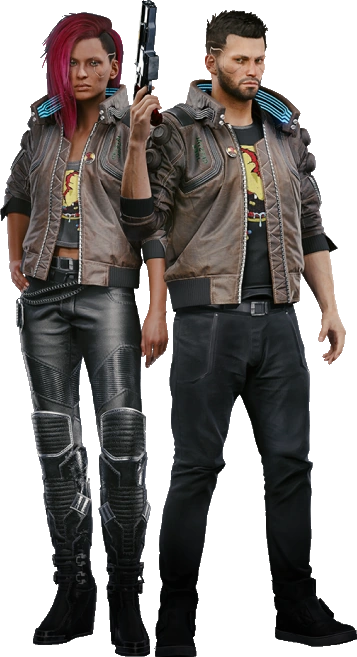
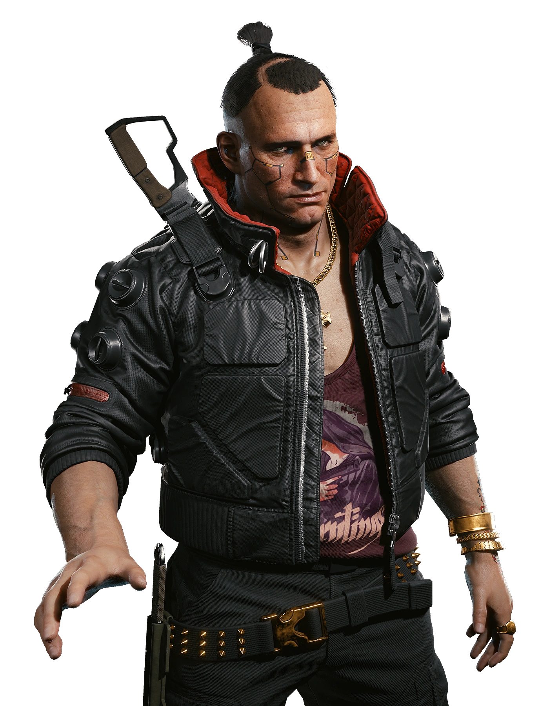
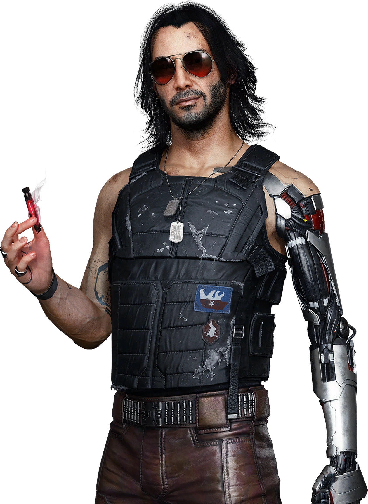
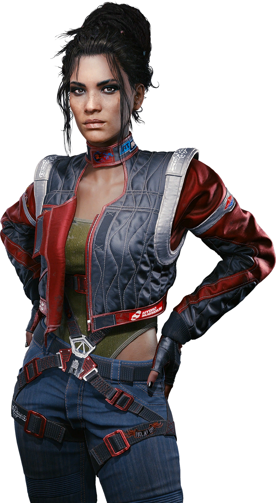
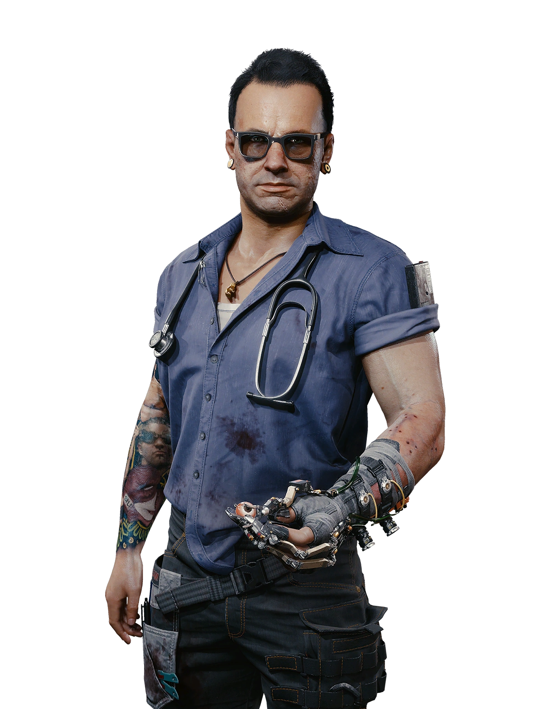
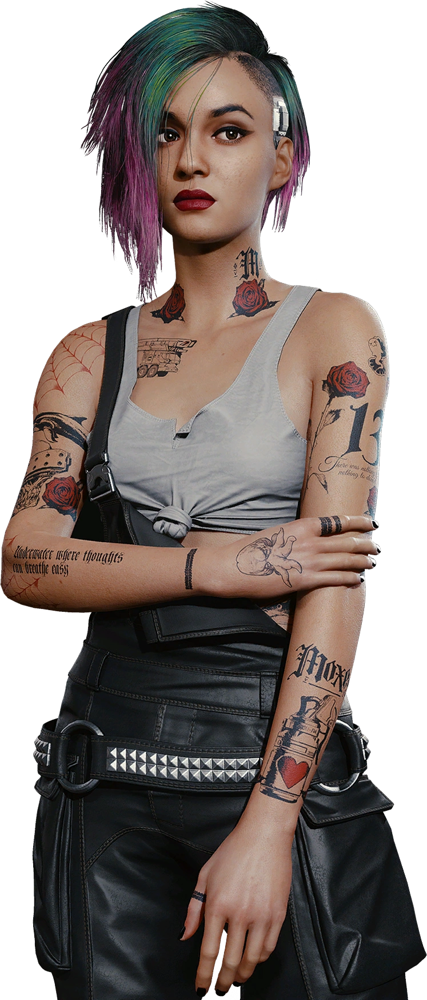

# Основные герои Cyberpunk 2077

## Ви (V)

- Главный герой игры, наемник, внешность и пол которого настраиваются игроком.
- Живёт и действует в Найт-Сити.
- Случайно внедряет в свой мозг сознание рокербоя Джонни Сильверхенда, что запускает главные события игры.

{: width="200px" }

---

## Джеки Уэллс (Jackie Wells)

- Лучший друг и напарник Ви, опытный соло-наемник.
- Сопровождает Ви на ранних этапах игры и поддерживает в боевых миссиях.
- Обладает своими жизненными целями и характером.

{: width="260px" }

---

## Джонни Сильверхенд (Johnny Silverhand)

- Известный рокербой и анархист с кибернетической рукой.
- Голос и внешность — Киану Ривз.
- Живёт в сознании Ви как «призрак» после внедрения в мозг героя.

{: width="200px" }

---

## Панам Палмер (Panam Palmer)

- Опытная наёмница из кочевого племени Кочевников.
- Важный союзник Ви в некоторых сюжетных линиях.
- Отличается независимым характером и мастерством в бою.

{: width="200px" }

---

## Виктор (Victor)

- Техник и имплантолог Ви.
- Помогает герою с апгрейдами и поддерживает в городе.
- Работа Виктора важна для выживания в Найт-Сити.

{: width="260px" }

---

## Джуди Альварес (Judy Alvarez)

- Талантливый техник и хакерша.
- Участвует в важных миссиях Ви.
- Имеет сложные отношения с главным героем.

{: width="160px" }
