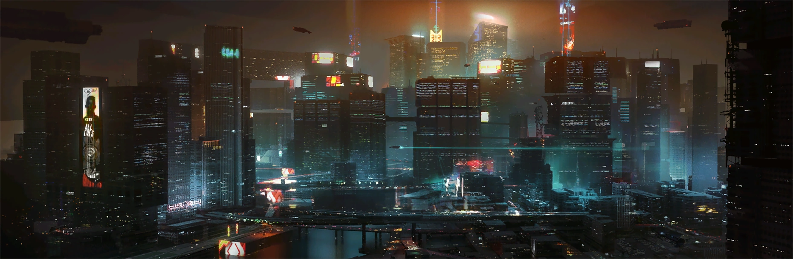
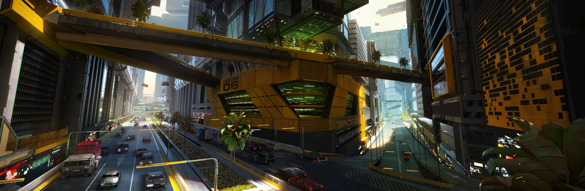
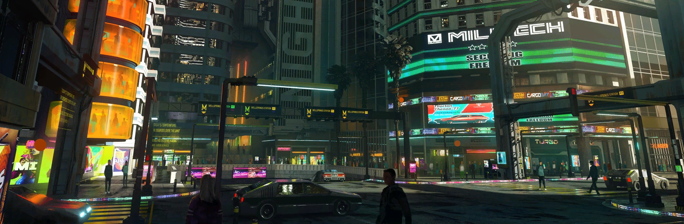
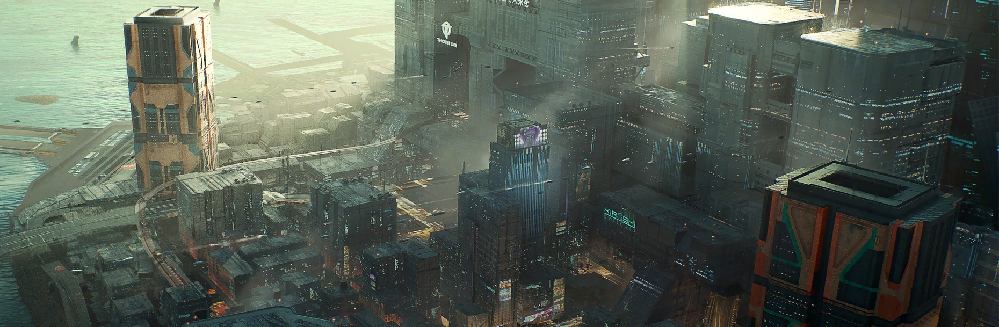
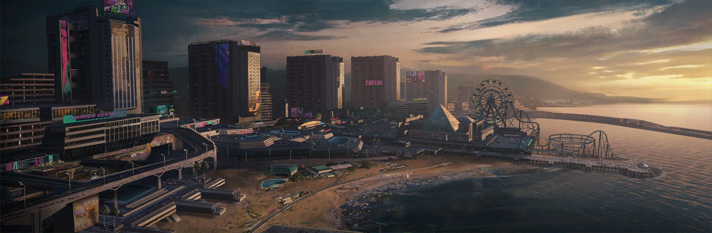
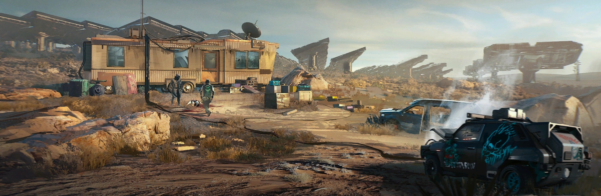
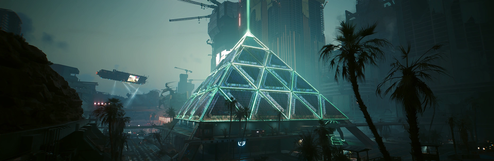

# Найт-Сити

Найт-Сити — футуристический мегаполис, ставший центральной ареной вселенной Cyberpunk. Город разделен на несколько важных районов и зон с уникальной атмосферой.

## Основные районы

### Городской центр (City Center)

Городской центр — это сердце Найт-Сити, где сосредоточена власть мегакорпораций. Здесь высокие небоскребы, современные офисы и элитные жилые кварталы. Район отличается максимальной безопасностью и постоянным присутствием охранных агентств.

---

### Уэстбрук (Westbrook)

Уэстбрук — богатый и престижный район, известный своими элитными жилыми комплексами и японским кварталом "Джапан-таун". Здесь процветают ночные клубы, дорогие рестораны и известные магазины.

- Центр высшего класса Найт-Сити.
- Влияние корпорации Arasaka сильно ощущается.
- Много зелёных зон и современных жилых массивов.

---

### Уотсон (Watson)

Уотсон — исторически промышленный и торговый район, сейчас страдающий от упадка и высокой преступности. Здесь смешение культур и множество восточноазиатских кварталов, включая знаменитый Little China и Kabuki.

- Район с контрастами: от рынков и магазинов до трущоб и криминала.
- Главные банды: Мальстрем, Тигриные когти.
- Популярен среди мигрантов.

---

### Хейвуд (Heywood)

Хейвуд — крупный жилой район среднего класса, куда переезжают семьи и работники. Здесь много пригородных домов, торговых центров и парков.

- Более спокойный и безопасный по сравнению с остальными районами.
- Контролируется латиноамериканскими бандами.
- Постоянный рост населения и развитие инфраструктуры.

---

### Санто-Доминго (Santo Domingo)

Санто-Доминго — индустриальный район с заводами, электростанциями и рабочими кварталами. Немало техно-индустриальных предприятий размещены именно здесь.

- Значительный промышленный потенциал.
- Много рабочих и инженеров.
- Зоной контролируют вооружённые банды.

---

### Пасифика (Pacifica)

Пасифика — район, который задумывался как туристический курорт, но после экономического краха превратился в зону беззакония с многочисленными заброшенными зданиями. Управляется несколькими враждующими бандами.

- Заброшенные пляжи, торговые центры и отели.
- Высокий уровень безысходности и преступности.
- Доминирование банд, таких как Voodoo Boys.

---

### Пустоши (Badlands)

Пустоши — низконаселённые зоны с постапокалиптической атмосферой. Здесь живут маргиналы и бандиты, а также находятся различные независимые поселения и ранчо.

- Враждебная, суровая природа.
- Основное место для нелегальной деятельности и боевых столкновений.
- Далеко от центра города, но значимо для некоторых сюжетных линий.

---

### Пёсий город (Dogtown)

Пёсий город — новый район Найт-Сити, добавленный в дополнении Phantom Liberty. Он расположен в районе Пасифика и отделён от остального города высокой стеной с контрольно-пропускным пунктом.

- Район представляет собой смесь заброшенных зданий и роскошных комплексов.
- Планы не осуществились из-за экономических кризисов и войн.
- Власть принадлежит военизированной группировке "Баргест" под руководством полковника Курта Хансена..

